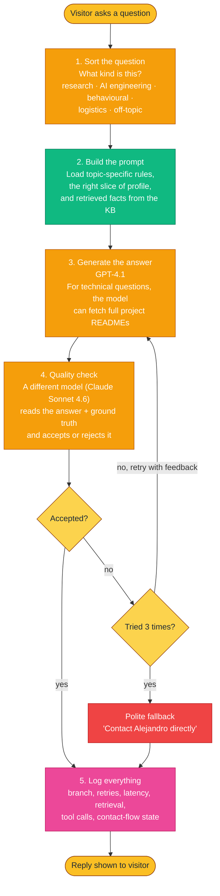
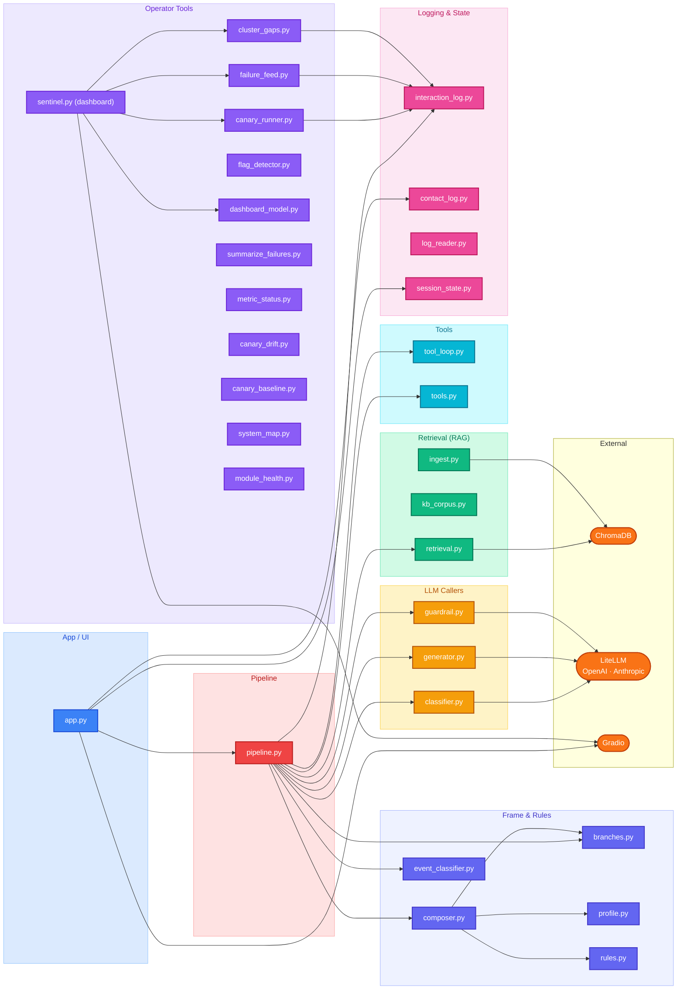

# Digital Twin

A conversational agent that answers professional questions about Alejandro de la Fuente — experience, research, projects, skills, and career trajectory — grounded in a curated knowledge base.

Built as a portfolio piece to demonstrate production-grade RAG, branch-routed prompting, model-as-judge evaluation, and observability — not a generic chatbot wrapper.

[](https://www.python.org/downloads/)
[](https://github.com/astral-sh/uv)
[](LICENSE)

---

## What this is

A Gradio chat interface where recruiters and hiring managers can ask focused questions about my background. Behind the surface, every turn goes through a multi-stage pipeline: a small classifier routes the question to a topic-specific prompt, retrieval pulls relevant context from a vector store, a generator drafts an answer (with optional tool use to fetch project docs), and a separate model acts as a guardrail to check the result before it reaches the user. Failed attempts retry with structured feedback up to three times; persistent failures fall back to a polite "contact me directly" message.

Every turn is logged with branch, classifier confidence, retrieval chunks, tool calls, retry attempts, and latency — readable in a local Gradio dashboard ("Sentinel") for drift detection and gap discovery.

## How it works

The runtime, in plain language:



**Key ideas:**

- **Classify-then-route.** A small, cheap model (`gpt-4.1-nano`) labels each question. Different question types load different rules and profile sections — a behavioural question needs personal-stories context; a technical question needs transferable-skill framing and the ability to fetch project docs.
- **Frame vs Substance.** A small always-on profile (~2 k tokens) supplies identity and rules ("Frame"); a larger knowledge base is retrieved on demand ("Substance"). Frame stays consistent; Substance scales without bloating context.
- **Model-as-judge guardrail.** A second model from a different family reviews each answer against the same context the generator saw. Three rejection-feedback retries before fallback.
- **Tool use, scoped.** Only the technical branch can fetch project READMEs via a registered `fetch_project_readme` tool. Other branches don't have access — the model can't invent it.
- **One log, every turn.** A single JSONL log captures the full record: classifier output, retrieval, attempts, latency, tool calls, contact-flow state. Live and canary runs share the same schema, distinguished by an `is_canary` flag.

## Module graph

How the codebase fits together. Modules are grouped by responsibility; arrows are import dependencies.



The full annotated graph (every module, every edge) lives in [`docs/MAP.md`](./docs/MAP.md), regenerated by `uv run python src/system_map.py`.

## Quick start

**Requirements:** Python 3.12+, [`uv`](https://github.com/astral-sh/uv), an OpenAI API key, an Anthropic API key.

```bash
# Clone and install
git clone https://github.com/AlejandroFuentePinero/digital-twin
cd digital-twin
uv sync

# Configure secrets
cp .env.example .env
# Edit .env — add OPENAI_API_KEY and ANTHROPIC_API_KEY

# Build the vector store from the knowledge base
uv run python src/ingest.py

# Launch the chat
uv run python src/app.py
# Opens at http://127.0.0.1:7860

# Launch the operator dashboard (separate terminal)
uv run python src/sentinel.py
```

## Project structure

```
digital-twin/
├── src/
│   ├── app.py                  # Gradio chat (entry point)
│   ├── pipeline.py             # Per-turn orchestrator
│   ├── classifier.py           # Question routing (gpt-4.1-nano)
│   ├── generator.py            # Answer generation (gpt-4.1)
│   ├── guardrail.py            # Quality check (Claude Sonnet 4.6)
│   ├── retrieval.py            # Vector search (ChromaDB)
│   ├── composer.py             # Prompt assembly per branch
│   ├── branches.py             # Branch registry (rules + profile slices)
│   ├── tool_loop.py            # Bounded tool-use loop
│   ├── tools.py                # fetch_project_readme tool
│   ├── interaction_log.py      # Per-turn enriched log writer
│   ├── session_state.py        # Per-session contact-flow state
│   ├── sentinel.py             # Operator dashboard (Gradio)
│   ├── canary_runner.py        # CLI: replay corpus N times for drift
│   └── assets/custom.css       # UI theme
├── data/
│   ├── profile.md              # Always-on Frame (~2k tokens)
│   ├── knowledge_base/         # Substance — RAG'd on demand
│   ├── readmes/                # Tool-only project docs (24 entries)
│   ├── canaries/               # Drift-detection corpus + baseline
│   └── logs/                   # JSONL interaction + contact logs
├── docs/
│   ├── MAP.md                  # Auto-generated system map
│   ├── adr/                    # Architectural decisions (3 ADRs)
│   ├── TODO.md                 # Active phase plan
│   ├── DECISIONS.md            # Session-by-session log
│   └── LIMITATIONS.md          # Known limitations register
├── eval/
│   └── tests.jsonl             # 149 evaluation Q&A pairs
├── tests/                      # Unit tests (matching test_<module>.py)
├── CONTEXT.md                  # Domain glossary
├── CLAUDE.md                   # AI-collaborator guidance
└── pyproject.toml
```

## Testing

The test suite is mock-at-boundary: real glue + real composition + fake LLM/network. No tests call live APIs.

```bash
uv run pytest                          # full suite
uv run pytest tests/test_pipeline.py   # one module
uv run python src/module_health.py     # local module-health dashboard
```

Conventions live in [`docs/TESTING.md`](./docs/TESTING.md): one matching `test_<module>.py` per module, mocking only at the LLM/disk boundary, exemption list for utilities that don't need a test file.

## Evaluation

A 149-question evaluation set in [`eval/tests.jsonl`](./eval/tests.jsonl) covers seven question categories (direct fact, temporal, comparative, numerical, relationship, spanning, holistic). Retrieval metrics: MRR, nDCG, keyword coverage. Answer metrics: LLM-as-judge on accuracy, completeness, relevance.

A separate **canary corpus** of 50 probe questions (`data/canaries/corpus.json`) is replayed N times via `canary_runner.py` to detect drift between releases. Canary records share the live log file and are surfaced via a dedicated tab in the operator dashboard.

## Architecture decisions

The system was redesigned in 2026-04. Three short ADRs capture the load-bearing decisions:

- [**ADR-0001**](./docs/adr/0001-always-on-profile-and-kb-as-depth.md) — Why a small always-on profile + retrieved KB beats a single retrieved-everything approach.
- [**ADR-0002**](./docs/adr/0002-hf-dataset-as-canonical-log-store.md) — One enriched JSONL log replaces a three-file plan; HuggingFace Dataset as the prod store.
- [**ADR-0003**](./docs/adr/0003-classify-then-route-orchestration.md) — Why classify-then-route, not retrieval-only or single-prompt approaches.

[`docs/LIMITATIONS.md`](./docs/LIMITATIONS.md) is a living register of observed and predicted limitations with explicit trip-wire conditions per entry.

## Tech stack

- **Models:** `gpt-4.1-nano` (classifier), `gpt-4.1` (generator), `claude-sonnet-4-6` (guardrail), `text-embedding-3-small` (retrieval).
- **LLM gateway:** [LiteLLM](https://github.com/BerriAI/litellm) — single client across providers.
- **Vector store:** [ChromaDB](https://www.trychroma.com/) — local persistent collection.
- **UI:** [Gradio](https://gradio.app/) 5.x with `gr.Blocks`, `gr.Chatbot`, custom CSS theme.
- **Validation:** Pydantic 2 for record schemas and tool arguments.
- **Reliability:** Tenacity for retries on transient provider errors.

## Documentation index

| Document | Purpose |
|---|---|
| [`CONTEXT.md`](./CONTEXT.md) | Domain glossary — every term with a precise definition |
| [`docs/MAP.md`](./docs/MAP.md) | Full system map (runtime + every module) |
| [`docs/adr/`](./docs/adr/) | Architectural decisions with rationale |
| [`docs/TODO.md`](./docs/TODO.md) | Active phase plan |
| [`docs/DECISIONS.md`](./docs/DECISIONS.md) | Session-by-session log |
| [`docs/TESTING.md`](./docs/TESTING.md) | Testing conventions |
| [`docs/LIMITATIONS.md`](./docs/LIMITATIONS.md) | Known limitations register |

## Contact

Alejandro de la Fuente — AI Engineer, Melbourne.
[GitHub](https://github.com/AlejandroFuentePinero) · [LinkedIn](https://www.linkedin.com/in/alejandro-dela-fuente/) · [Portfolio](https://alejandrofuentepinero.github.io/) · alejandrofuentepinero@gmail.com

## License

MIT — see [`LICENSE`](./LICENSE).
