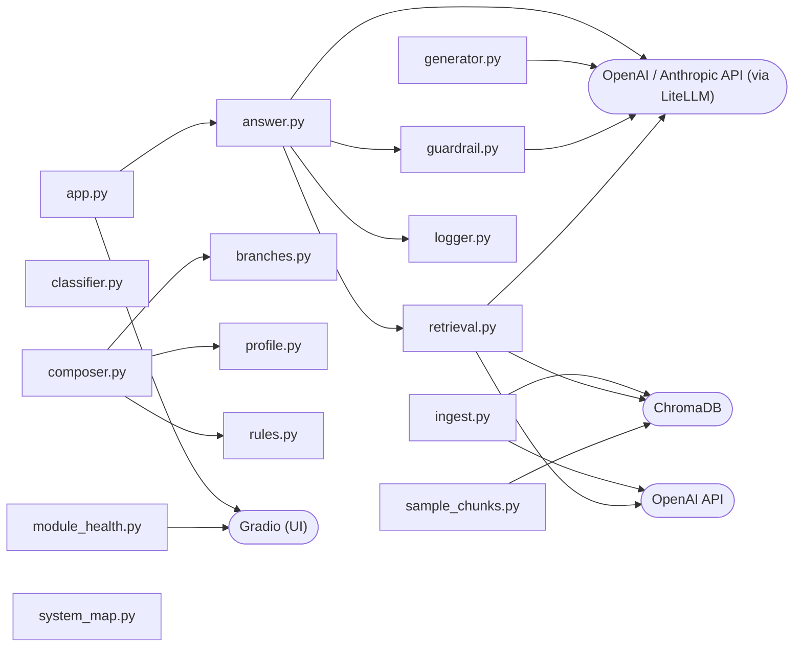

# System Map

Auto-generated by `src/system_map.py`. Do not edit by hand — re-run with `uv run python src/system_map.py` after touching modules in `src/`.

Companion docs: [`CONTEXT.md`](../CONTEXT.md) (domain glossary), [`docs/adr/`](./adr/) (architectural decisions).

## Module graph

## Glossary

| Module | Description |
|---|---|
| `answer.py` | RAG retrieval and generation for the digital twin. |
| `app.py` | Gradio chat interface for the digital twin. |
| `branches.py` | Branch registry for classify-then-route orchestration (ADR-0003). |
| `classifier.py` | Branch classifier (ADR-0003). |
| `composer.py` | Prompt composer — assembles per-branch system prompts (ADR-0003). |
| `generator.py` | Generator — wraps the answer LLM call. |
| `guardrail.py` | Guardrail — branch-aware quality evaluator (ADR-0003). |
| `ingest.py` | Ingest the digital twin knowledge base into ChromaDB. |
| `logger.py` | Append-only JSONL interaction logger for the digital twin. |
| `module_health.py` | Local Gradio dashboard showing pass/fail status of digital-twin tests. |
| `profile.py` | Always-on profile loader (the Frame, per ADR-0001 / ADR-0003). |
| `retrieval.py` | Retrieval helpers — embedding, ChromaDB query, merge, rewrite, rerank, format. |
| `rules.py` | Shared rule fragments composed into generator and guardrail system prompts. |
| `sample_chunks.py` | Sample and inspect chunks from the ChromaDB knowledge base. |
| `system_map.py` | System map generator — walks src/ and emits docs/MAP.md. |
