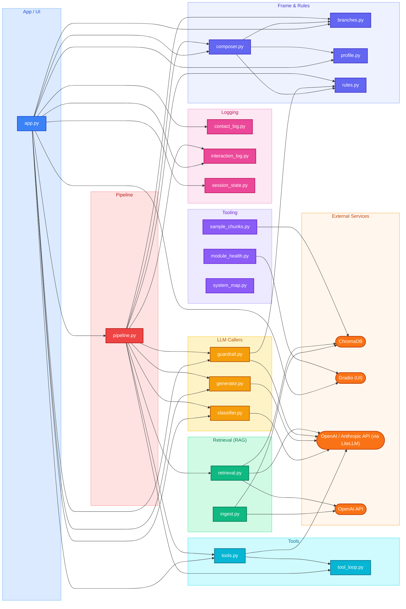

# System Map

Auto-generated by `src/system_map.py`. Do not edit by hand — re-run with `uv run python src/system_map.py` after touching modules in `src/` or after editing `docs/pipeline_diagram.mmd`.

Companion docs: [`CONTEXT.md`](../CONTEXT.md) (domain glossary), [`docs/adr/`](./adr/) (architectural decisions).

## Pipeline behaviour (runtime)

How a user question becomes a response — branch routing, retry loop, side effects, and tool placeholders. Hand-edited at [`docs/pipeline_diagram.mmd`](./pipeline_diagram.mmd); rerun `uv run python src/system_map.py` to regenerate this section after editing.

**Legend:** orange = LLM call · green = pure transform · yellow = decision · pink = side effect · red = canned refusal · dashed grey = future tool · orange ovals = user I/O.

```mermaid
%%{init: {'flowchart': {'nodeSpacing': 45, 'rankSpacing': 55, 'curve': 'basis', 'padding': 12}}}%%
%% Hand-editable runtime pipeline diagram for the Digital Twin.
%% Edit this file whenever pipeline behaviour changes — new branch, new tool,
%% new decision point, retry policy change, new log field. After editing run:
%%   uv run python src/system_map.py
%% to regenerate docs/MAP.md and docs/MAP.html (both this diagram and the
%% auto-generated module graph).
%% Colour conventions: orange = LLM call, green = pure transform,
%% yellow = decision, pink = side effect, red = canned refusal,
%% cyan = model-callable tool (TECHNICAL branch),
%% dashed grey = future / not yet wired.
flowchart TD
  classDef io fill:#fbbf24,stroke:#92400e,color:#1f2937,stroke-width:2px
  classDef llm fill:#f59e0b,stroke:#b45309,color:#ffffff,stroke-width:2px
  classDef decision fill:#fcd34d,stroke:#92400e,color:#1f2937,stroke-width:2px
  classDef pure fill:#10b981,stroke:#047857,color:#ffffff,stroke-width:2px
  classDef sideEffect fill:#ec4899,stroke:#be185d,color:#ffffff,stroke-width:2px
  classDef refusal fill:#ef4444,stroke:#b91c1c,color:#ffffff,stroke-width:2px
  classDef tool fill:#06b6d4,stroke:#0e7490,color:#ffffff,stroke-width:2px
  classDef future fill:#cbd5e1,stroke:#64748b,color:#1f2937,stroke-width:2px,stroke-dasharray:5 4

  USER([User question + history]):::io
  USER --> CLASSIFY["Classifier — gpt-4.1-nano<br/>last 2 turns + question<br/>multi-label + confidence"]:::llm
  CLASSIFY --> CONF{"confidence &ge; 0.5?"}:::decision
  CONF -->|no| GENFALL["override labels = GENERIC"]:::pure
  CONF -->|yes| FILTER["filter labels[:2] to<br/>known REGISTRY branches"]:::pure
  GENFALL --> FILTER
  FILTER --> EMPTY{"any branch<br/>survived filter?"}:::decision
  EMPTY -->|no| GENFALL2["branches = GENERIC<br/>safe fallback"]:::pure
  EMPTY -->|yes| ROUTE["branches = surviving labels<br/>(max 2 per ADR-0003)"]:::pure
  GENFALL2 --> RETR
  ROUTE --> RETR["Retrieval — fetch_context<br/>ChromaDB top-K<br/>K = branch.final_k"]:::pure
  RETR --> COMP["PromptComposer<br/>UNIVERSAL rules + branch_rules<br/>+ profile sections (incl. active_learning for GAP)<br/>+ retrieved context"]:::pure
  COMP --> GEN["Generator — gpt-4.1<br/>system + history + question"]:::llm
  GEN -->|"TECHNICAL branch only<br/>ToolLoop, MAX_TOOL_CALLS = 3<br/>per attempt"| TOOL["fetch_project_readme<br/>distilled README<br/>from data/readmes/"]:::tool
  TOOL --> GEN
  TOOL -.->|"tool-fetched content<br/>recomposed into judge prompt<br/>so guardrail sees what model grounded in<br/>(LIMITATIONS::R1)"| JUDGE
  GEN --> JUDGE["Guardrail — Claude Sonnet 4.6<br/>same composed prompt + answer<br/>distinct model family"]:::llm
  JUDGE --> ACCEPT{"is_acceptable?"}:::decision
  ACCEPT -->|yes| LOG["InteractionLog append (JSONL)<br/>branch, classifier_labels, attempts,<br/>retrieved_chunks, latency_ms"]:::sideEffect
  ACCEPT -->|"no — rejection feedback<br/>wraps into next system prompt"| RETRY{"attempts &lt; MAX_ATTEMPTS = 3?"}:::decision
  RETRY -->|yes| GEN
  RETRY -->|no| REFUSE["CANNED_REFUSAL<br/>polite decline + contact email"]:::refusal
  REFUSE --> LOG
  LOG --> RESP([Response to user]):::io
```

## Module graph

## Glossary

| Module | Description |
|---|---|
| `app.py` | Gradio chat interface for the digital twin. |
| `branches.py` | Branch registry for classify-then-route orchestration (ADR-0003). |
| `classifier.py` | Branch classifier (ADR-0003). |
| `composer.py` | Prompt composer — assembles per-branch system prompts (ADR-0003). |
| `contact_log.py` | Contact-form record schema + JSONL writer/reader (#16). |
| `generator.py` | Generator — wraps the answer LLM call. |
| `guardrail.py` | Guardrail — branch-aware quality evaluator (ADR-0003). |
| `ingest.py` | Ingest the digital twin knowledge base into ChromaDB. |
| `interaction_log.py` | Enriched per-turn interaction log (ADR-0002 / issue #13 step 7). |
| `module_health.py` | Local Gradio dashboard showing pass/fail status of digital-twin tests. |
| `pipeline.py` | Per-turn orchestrator (ADR-0003). |
| `profile.py` | Always-on profile loader (the Frame, per ADR-0001 / ADR-0003). |
| `retrieval.py` | Retrieval helpers — embedding, ChromaDB query, merge, rewrite, rerank, format. |
| `rules.py` | Shared rule fragments composed into generator and guardrail system prompts. |
| `sample_chunks.py` | Sample and inspect chunks from the ChromaDB knowledge base. |
| `session_state.py` | Per-session state for #16's contact-flow. |
| `system_map.py` | System map generator — walks src/ and emits docs/MAP.md. |
| `tool_loop.py` | Generic bounded tool loop for the TECHNICAL branch (#18 / ADR-0003). |
| `tools.py` | Tool registry for the TECHNICAL branch (ADR-0003 + #18). |
